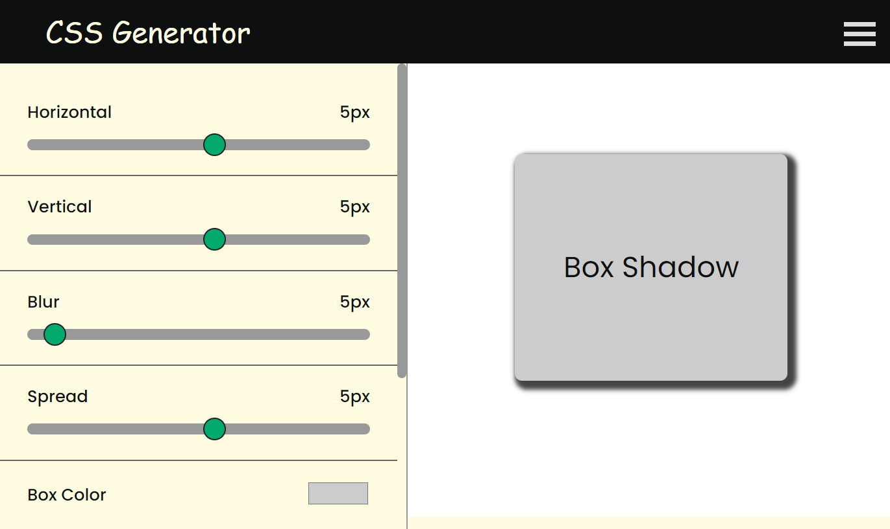

# CSS Code Generator

## Description
Welcome to the CSS Code Generator! This tool allows you to easily create text-shadow, box-shadow, text styles, flexbox and much more for your web projects.

## Features

### 1. Box Shadow 
### 2. Text Shadow
### 3. Text Styles
### 4. Transform
### 5. Flexbox
### 6. Image Filter

## Getting Started
1. Visit [https://css.karansencha.com/](https://css.karansencha.com/).
2. Select the desired generator (Text-Shadow or Box-Shadow).
3. Adjust the parameters to customize your CSS.
4. Copy the generated code snippet into your project's CSS file.

## Build with
- React
- Java Script
- CSS
- HTML

## Feedback and Support
Your feedback is valuable! If you encounter any issues or have suggestions for improvement, please [contact us](mailto:karanenquiry1@gmail.com).

## Developer
- **Developer:** [Karan Sencha](https://karansencha.com/)
- **Contact:** [karanenquiry1@gmail.com](mailto:karanenquiry1@gmail.com)

